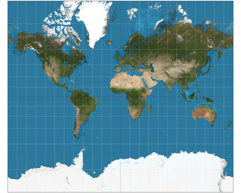
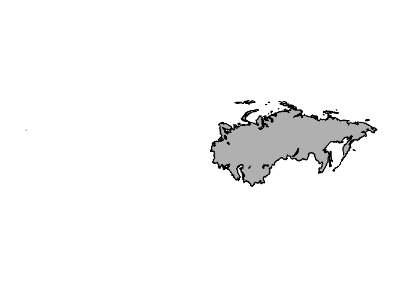
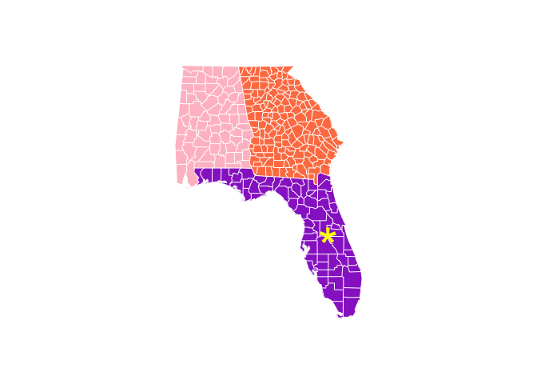
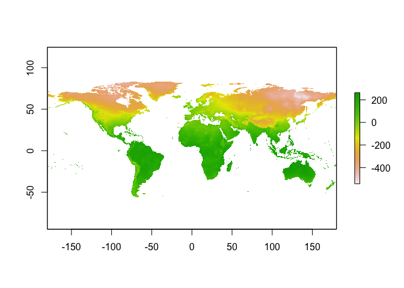
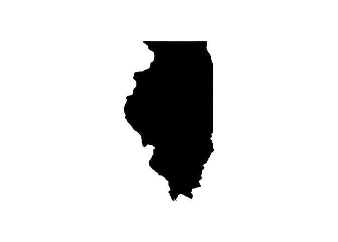

## Basics of spatial data

Spatial data can come in 2 formats: vector or raster. Vector data is comprised of vertices and paths that connect to form points, lines, and polygons. "Shapefiles" are one of the most common vector formats you see in spatial data. Rasters, on the other hand, are made of a matrix of grid cells or pixels. For simple maps, you'll most often work with shapefiles. 

<!-- -->

## Map projections 
To view the Earth on our screen, we need to figure out how to represent a 3-D object on a 2-D plane. This can be accomplished by projecting the Earth onto a flat surface. Map projections necessarily involve the loss of some data:

* area
* shape
* direction
* distance
* scale

### Mercator projection: preserves direction, but distorts size
<!-- -->

### Gall-Peters projection: preserves size, but distorts distance
<!-- -->

Important note! The default projection in R is to use a rectangular projection with the aspect ratio chosen so that longitude and latitude scales are equivalent at the center of the picture. This might be okay for some areas, but for others you can get a funky display. Thus, when working with data sources without defined projections, you may have to define the projection. I'll show an example of this later on. 

<!-- --><!-- -->

## Some key spatial packages:
* rgdal - reading, writing, converting between spatial data in dozens of formats
* maps - basic maps: continents, countries, states, and counties
* mapdata - higher res maps
* mapproj - projecting spatial data
* sp - basic functions for spatial data
* raster - working with raster data 


```r
# load relevant packages
# install.packages(c("ggplot2","dplyr","stringr","ggmap","maps","mapdata","rgdal",
#                    "maptools","mapproj","sp","raster","grDevices","RColorBrewer"))
library(ggplot2)
library(dplyr)
library(stringr)
library(ggmap)
library(maps)
library(mapdata)
library(rgdal)
library(maptools)
library(mapproj)
library(sp)
library(raster)
library(grDevices)
library(RColorBrewer)
```


## Making basic maps 
Maps can be created in base R or ggplot. The `map` function uses map databases to create maps from vector data. Many arguments in the `map` function are similar to plots in base R. 


```r
# Base maps 
map(database = "world", regions = "Russia", col = "gray", fill = TRUE)
```

<!-- -->

However, different databases can have different names, extents, resolution, etc. 


```r
map(database = "worldHires", regions = "Russia", col = "gray", fill = TRUE)
```

```
## Error in map.poly(database, regions, exact, xlim, ylim, boundary, interior, : no recognized region names
```

There's no 'Russia' map in the worldHires database, but there is a USSR.


```r
map(database = "worldHires", regions = "USSR", col = "gray", fill = TRUE)
```

<!-- -->


You can change the projection of your map with the `projection` and `parameters` arguments. 

```r
map('world', projection = 'mercator', wrap =TRUE, col = rainbow (7), fill = TRUE)
```

```
## Warning in map("world", projection = "mercator", wrap = TRUE, col =
## rainbow(7), : projection failed for some data
```

<!-- -->

```r
map('world', projection = 'gall', wrap =TRUE, parameters = 45, col = rainbow (7), fill = TRUE)
```

<!-- -->

```r
map('world', projection = 'polyconic', wrap = TRUE, col = rainbow (7), fill = TRUE)
```

<!-- -->

## Clipping maps 
`xlim()` and `ylim()` can be useful for clipping your map to the region of interest. To determine the current bounds of your map, you can use `min()` and `max()` arguments on your stored map object. Then you can change the min/max in the plot `map` arguments.  

```r
USA<- map(database = "world", regions = "usa", col = "green", fill = TRUE)
```

<!-- -->

```r
min(USA$x, na.rm = T)
```

```
## [1] -178.1945
```

```r
max(USA$x, na.rm = T)
```

```
## [1] 179.78
```

Alternatively, you can use the `locator()` function to return the x and y coordinates anywhere you click in the map region. To determine the x and y coordinates to bound your map, use `locator(2)` and click in the lower left and upper right corners of where you'd like to click your map. Then you can add these coordinates as your x and y lim. 


```r
# locator(2)
# $x
# [1] -180.97763  -54.55716

# $y
# [1]  9.426121 76.765763

map(database = "world", regions = "usa", col = "green", fill = TRUE, xlim = c(-180.97763, -54.55716), ylim = c(9.426121, 76.765763))
```

<!-- -->

You can select multiple regions, colors, and can layer maps from multiple databases. You can also add elements with `points` at any latitude and longitude. Note that y is latitude and x is longitude in maps -- don't get these mixed up! 


```r
map(database = "state", regions = c("Florida","Georgia","Alabama"), col = c("pink", "darkorchid", "coral"), fill = TRUE, border = NA)
map("county", regions = c("Florida","Georgia","Alabama"), add = T, col = "white")
disney<- c(28.3852, -81.5639) # latitude/longitude points for Disney world
points(x = disney[2], y = disney[1], pch="*", cex=4, col = "yellow") # note the switching of lat/long to work with x/y 
```

<!-- -->

## Making maps with raster data 
R can also call raster data from many databases. Beware: these can take a long time to download and can cause R to crash -- save your workspace before loading! 

```r
# climate data - note temps are degrees C * 10
world_temps <- raster:::getData('worldclim', var='tmin', res=10, lon=5, lat=45)
plot(world_temps$tmin1)
```

<!-- -->

```r
# future climate data 
climate_change <- raster:::getData('CMIP5', var='tmax', res=10, rcp=85, model='AC', year=70)
```

```
## Warning in showSRID(uprojargs, format = "PROJ", multiline = "NO", prefer_proj
## = prefer_proj): Discarded datum Unknown based on WGS84 ellipsoid in Proj4
## definition

## Warning in showSRID(uprojargs, format = "PROJ", multiline = "NO", prefer_proj
## = prefer_proj): Discarded datum Unknown based on WGS84 ellipsoid in Proj4
## definition

## Warning in showSRID(uprojargs, format = "PROJ", multiline = "NO", prefer_proj
## = prefer_proj): Discarded datum Unknown based on WGS84 ellipsoid in Proj4
## definition

## Warning in showSRID(uprojargs, format = "PROJ", multiline = "NO", prefer_proj
## = prefer_proj): Discarded datum Unknown based on WGS84 ellipsoid in Proj4
## definition

## Warning in showSRID(uprojargs, format = "PROJ", multiline = "NO", prefer_proj
## = prefer_proj): Discarded datum Unknown based on WGS84 ellipsoid in Proj4
## definition

## Warning in showSRID(uprojargs, format = "PROJ", multiline = "NO", prefer_proj
## = prefer_proj): Discarded datum Unknown based on WGS84 ellipsoid in Proj4
## definition

## Warning in showSRID(uprojargs, format = "PROJ", multiline = "NO", prefer_proj
## = prefer_proj): Discarded datum Unknown based on WGS84 ellipsoid in Proj4
## definition

## Warning in showSRID(uprojargs, format = "PROJ", multiline = "NO", prefer_proj
## = prefer_proj): Discarded datum Unknown based on WGS84 ellipsoid in Proj4
## definition

## Warning in showSRID(uprojargs, format = "PROJ", multiline = "NO", prefer_proj
## = prefer_proj): Discarded datum Unknown based on WGS84 ellipsoid in Proj4
## definition

## Warning in showSRID(uprojargs, format = "PROJ", multiline = "NO", prefer_proj
## = prefer_proj): Discarded datum Unknown based on WGS84 ellipsoid in Proj4
## definition

## Warning in showSRID(uprojargs, format = "PROJ", multiline = "NO", prefer_proj
## = prefer_proj): Discarded datum Unknown based on WGS84 ellipsoid in Proj4
## definition

## Warning in showSRID(uprojargs, format = "PROJ", multiline = "NO", prefer_proj
## = prefer_proj): Discarded datum Unknown based on WGS84 ellipsoid in Proj4
## definition

## Warning in showSRID(uprojargs, format = "PROJ", multiline = "NO", prefer_proj
## = prefer_proj): Discarded datum Unknown based on WGS84 ellipsoid in Proj4
## definition
```

```r
plot(climate_change$ac85tx701)
```

<!-- -->

## Making maps in ggplot
Use `map_data` to turn map data into data frame that ggplot can read

```r
# plot all states with ggplot
states <- map_data("state") 
head(states)
```

```
##        long      lat group order  region subregion
## 1 -87.46201 30.38968     1     1 alabama      <NA>
## 2 -87.48493 30.37249     1     2 alabama      <NA>
## 3 -87.52503 30.37249     1     3 alabama      <NA>
## 4 -87.53076 30.33239     1     4 alabama      <NA>
## 5 -87.57087 30.32665     1     5 alabama      <NA>
## 6 -87.58806 30.32665     1     6 alabama      <NA>
```

```r
us_map<- ggplot(data = states) + 
  geom_polygon(aes(x = long, y = lat, fill = region, group = group), color = "white") + 
  guides(fill=FALSE) +
  theme_nothing()
us_map 
```

<!-- -->

```r
# fill color of each state by population
x <- read.csv("Maps_presentation_files/state_pop.csv", stringsAsFactors = FALSE)
head(x)
```

```
##       region Population Land.Area..sq.mi. Population.Density
## 1    alabama    4858979             50744               95.8
## 2     alaska     738432            571951                1.3
## 3    arizona    6828065            113635               60.1
## 4   arkansas    2978204             52068               57.2
## 5 california   39144818            155959              251.0
## 6   colorado    5456574            103718               52.6
```

```r
us_pop <- inner_join(states, x, by = "region")
us_pop$Population<- as.numeric(us_pop$Population)

ggplot(data = us_pop) +
  geom_polygon(aes(x = long, y = lat, fill = Population, group = group), color = "white") +
  theme_bw()
```

<!-- -->

A couple quick fixes to make this plot a little nicer: `coord_map()` gives a localized aspect ratio, `low` and `high` change the color gradient, and `trans` puts population on a log scale.   


```r
ggplot(data = us_pop) +
  geom_polygon(aes(x = long, y = lat, fill = Population, group = group), color = "white") +
  # scale_color_gradient(low = "lightgrey", high = "red") +
  coord_map() +
  scale_fill_gradient(low = "red", high = "blue", trans = "log10") +
  theme_bw()
```

<!-- -->


## Let's make a map! 
I need to create a study area map for my manuscript. I want to show my species localities and all streams in the state of Illinois. I also want to code each watershed within my map in a different color. I have a .csv file with lat/long data for my species localities, as well as a shapefile for Illinois streams. 

First, let's check out our streams file using the `readOGR` function to read in spatial data: 


```r
watersheds <- readOGR(dsn = "Maps_presentation_files/Stream_HUC4/stream_HUC4.shp")
```

```
## OGR data source with driver: ESRI Shapefile 
## Source: "/Users/kbja10/Github/making_maps_in_R_updated/Maps_presentation_files/Stream_HUC4/stream_HUC4.shp", layer: "stream_HUC4"
## with 13 features
## It has 3 fields
## Integer64 fields read as strings:  ID GRIDCODE
```

```r
summary(watersheds)
```

```
## Object of class SpatialPolygonsDataFrame
## Coordinates:
##         min       max
## x  148717.9  468731.4
## y 4183300.7 4724312.1
## Is projected: TRUE 
## proj4string :
## [+proj=utm +zone=16 +datum=NAD83 +units=m +no_defs]
## Data attributes:
##       ID              GRIDCODE              HUC4    
##  Length:13          Length:13          Min.   :512  
##  Class :character   Class :character   1st Qu.:709  
##  Mode  :character   Mode  :character   Median :712  
##                                        Mean   :696  
##                                        3rd Qu.:712  
##                                        Max.   :714
```

```r
plot(watersheds)
```

<!-- -->

We can see from the summary that this is a polygon shapefile that is projected in the UTM NAD83 zone 16 projection (more on that later). We can also see that there is an attribute for HUC4; this defines the code for each watershed in the state of Illinois. Next, let's get a map of the state:


```r
illinois<- map("state", regions = "Illinois", fill = T)
```

<!-- -->

Looks great! Now, let's put our streams on the map:


```r
map("state", regions = "Illinois")
plot(watersheds, add = T)
```

<!-- -->

What happened?? We just saw that our streams and our state plot out separately, but are not lining up when plotted together. If you recall, our watersheds are defined by the UTM NAD83 **projected coordinate system**, while we never defined a projection for our Illinois map. However, I looked up the metadata for the US Census Bureau (where the data from the 'state' database comes from) and their map data is in the NAD83 **geographic coordinate system**. There are a lot of differences between geographic and projected coordinate systems, but for now we can just understand that the units in a geographic coordinate system are decimal degrees (e.g. lat/longs), while the units in a projected coordinate system are feet/meters. 

So, what I need to do is turn the Illinois map into a spatial object and define the projection using `map2SpatialPolygons`. Then I can project it into the same projected coordinate system as my watersheds data with `spTransform`. 


```r
illinois<- map2SpatialPolygons(illinois, IDs=illinois$names, proj4string = CRS("+proj=longlat +datum=NAD83")) # define projection as NAD83 geographic coordinate system
summary(illinois)
```

```
## Object of class SpatialPolygons
## Coordinates:
##         min       max
## x -91.50136 -87.49638
## y  37.00161  42.50774
## Is projected: FALSE 
## proj4string : [+proj=longlat +datum=NAD83 +no_defs]
```

Now our illinois shapefile projection is defined. However, note the x and y are in decimal degrees and it is not projected. Contrast with the summary of our watersheds shapefile: 


```r
summary(watersheds)
```

```
## Object of class SpatialPolygonsDataFrame
## Coordinates:
##         min       max
## x  148717.9  468731.4
## y 4183300.7 4724312.1
## Is projected: TRUE 
## proj4string :
## [+proj=utm +zone=16 +datum=NAD83 +units=m +no_defs]
## Data attributes:
##       ID              GRIDCODE              HUC4    
##  Length:13          Length:13          Min.   :512  
##  Class :character   Class :character   1st Qu.:709  
##  Mode  :character   Mode  :character   Median :712  
##                                        Mean   :696  
##                                        3rd Qu.:712  
##                                        Max.   :714
```

To get the Illinois map into a projected coordinate system, let's first create an object to store the projection information from the watersheds file and then project Illinois into a projected coordinate system:

```r
UTMnad83<- CRS("+proj=utm +zone=16 +datum=NAD83 +units=m +no_defs")
illinois_proj<- spTransform(illinois, UTMnad83) # transform to UTMnad83
summary(illinois_proj)
```

```
## Object of class SpatialPolygons
## Coordinates:
##       min       max
## x  116589  456858.9
## y 4097263 4712603.0
## Is projected: TRUE 
## proj4string :
## [+proj=utm +zone=16 +datum=NAD83 +units=m +no_defs]
```

Now, the x and y for the illinois shapefile are in meters, just like our watersheds file. Now for the moment of truth: will they line up?? 


```r
plot(illinois_proj)
plot(watersheds, add = T)
```

<!-- -->

Now, let's import our species localities. I have a .csv file with lat/longs for the location of each species collection. Recall that lat/longs are in a geographic coordinate system, and we need to project them into a projected coordinate system so they line up with our watersheds. 


```r
localities <- read.csv("Maps_presentation_files/illinois_localities.csv")

# create a spatial object with 'coordinates' function and DONT FORGET TO ORDER IN X,Y FORMAT: LONG,LAT  
coordinates(localities)<- c("Longitude", "Latitude") 
summary(localities)
```

```
## Object of class SpatialPointsDataFrame
## Coordinates:
##                 min       max
## Longitude -90.75708 -87.52703
## Latitude   38.02549  42.48222
## Is projected: NA 
## proj4string : [NA]
## Number of points: 86
## Data attributes:
##    Catalogue         Family__   Genus_spec             Day_      
##  Min.   : 28218   Min.   :22   Length:86          Min.   : 1.00  
##  1st Qu.: 45273   1st Qu.:22   Class :character   1st Qu.:13.00  
##  Median : 58658   Median :22   Mode  :character   Median :18.00  
##  Mean   : 66608   Mean   :22                      Mean   :17.72  
##  3rd Qu.: 95917   3rd Qu.:22                      3rd Qu.:24.00  
##  Max.   :103908   Max.   :22                      Max.   :31.00  
##     Month_              Year_       F__Vouchered     F__Collected    
##  Length:86          Min.   :1984   Min.   :  8.00   Min.   :   8.00  
##  Class :character   1st Qu.:1990   1st Qu.: 15.25   1st Qu.:  18.25  
##  Mode  :character   Median :1997   Median : 25.50   Median :  30.50  
##                     Mean   :1996   Mean   : 47.05   Mean   :  71.83  
##                     3rd Qu.:1999   3rd Qu.: 55.75   3rd Qu.:  63.00  
##                     Max.   :2008   Max.   :479.00   Max.   :1354.00  
##    species_pe      Remarks           F__specimens  
##  Min.   : 1.00   Length:86          Min.   : 7.00  
##  1st Qu.:14.00   Class :character   1st Qu.:11.00  
##  Median :18.00   Mode  :character   Median :14.00  
##  Mean   :17.58                      Mean   :12.57  
##  3rd Qu.:21.00                      3rd Qu.:15.00  
##  Max.   :37.00                      Max.   :15.00
```

```r
proj4string(localities) <- CRS("+proj=longlat +datum=NAD83") # define projection
localities_proj<- spTransform(localities, UTMnad83) # transform to UTMnad83
summary(localities_proj)
```

```
## Object of class SpatialPointsDataFrame
## Coordinates:
##                 min       max
## Longitude  178696.1  454246.2
## Latitude  4209127.0 4705766.8
## Is projected: TRUE 
## proj4string :
## [+proj=utm +zone=16 +datum=NAD83 +units=m +no_defs]
## Number of points: 86
## Data attributes:
##    Catalogue         Family__   Genus_spec             Day_      
##  Min.   : 28218   Min.   :22   Length:86          Min.   : 1.00  
##  1st Qu.: 45273   1st Qu.:22   Class :character   1st Qu.:13.00  
##  Median : 58658   Median :22   Mode  :character   Median :18.00  
##  Mean   : 66608   Mean   :22                      Mean   :17.72  
##  3rd Qu.: 95917   3rd Qu.:22                      3rd Qu.:24.00  
##  Max.   :103908   Max.   :22                      Max.   :31.00  
##     Month_              Year_       F__Vouchered     F__Collected    
##  Length:86          Min.   :1984   Min.   :  8.00   Min.   :   8.00  
##  Class :character   1st Qu.:1990   1st Qu.: 15.25   1st Qu.:  18.25  
##  Mode  :character   Median :1997   Median : 25.50   Median :  30.50  
##                     Mean   :1996   Mean   : 47.05   Mean   :  71.83  
##                     3rd Qu.:1999   3rd Qu.: 55.75   3rd Qu.:  63.00  
##                     Max.   :2008   Max.   :479.00   Max.   :1354.00  
##    species_pe      Remarks           F__specimens  
##  Min.   : 1.00   Length:86          Min.   : 7.00  
##  1st Qu.:14.00   Class :character   1st Qu.:11.00  
##  Median :18.00   Mode  :character   Median :14.00  
##  Mean   :17.58                      Mean   :12.57  
##  3rd Qu.:21.00                      3rd Qu.:15.00  
##  Max.   :37.00                      Max.   :15.00
```

Now we have everything in order, and we can plot up our spatial objects! Remember that I need to shade my unique watersheds and individual species in unique colors. This is made easy with palettes in RColorBrewer. 


```r
water_pal<- brewer.pal(n = 5, name = "Blues") # for my streams 
species_pal<- brewer.pal(n = 6, name = "Dark2")

plot(illinois_proj, col="gray24") # plot projected illinois shapefile
water_col <- 1 # create number to call for indexing colors from palette
for (i in unique(watersheds$HUC4)){
  plot(watersheds[watersheds$HUC4 == i, ], add=T, border = water_pal[water_col], col = water_pal[water_col]) # plot each watershed in a different color
  water_col<- water_col+1 
}

species_col<- 1 
for (i in unique(localities_proj$Genus_spec)){
  plot(localities_proj[localities_proj$Genus_spec == i, ], add=T, pch = 21, bg = species_pal[species_col], col = "black", cex = 1.3)
  species_col<- species_col+1
}

legend("topright", unique(localities_proj$Genus_spec), pch=21, pt.bg=species_pal, col="black", bty="n", text.font=3)
```

<!-- -->


## Another example
Let's make another sampling map of sampling locations around a lake using different sampling gears. We have lat/longs of our sampling locations and have downloaded shapefiles of U.S. lakes from ArcGIS. Our map will also include a scale bar and an inset map of the northeastern U.S.


```r
all_sampling_points <- read.csv("Maps_presentation_files/all_sampling_points.csv")
ef_dat <- read.csv("Maps_presentation_files/EF spring std site locations2.csv")
lakes <- readOGR("Maps_presentation_files/ne_10m_lakes") # file path to lake shapefile
```

```
## OGR data source with driver: ESRI Shapefile 
## Source: "/Users/kbja10/Github/making_maps_in_R_updated/Maps_presentation_files/ne_10m_lakes", layer: "ne_10m_lakes"
## with 1354 features
## It has 37 fields
## Integer64 fields read as strings:  scalerank ne_id
```

```r
lakes <- lakes[complete.cases(lakes$name), ]
great_lakes_map <- subset(lakes, name==c("Lake Ontario","Lake Erie"))
oneida_map <- subset(lakes, name=="Oneida Lake")
```

First, we'll make the main sampling map. 


```r
mapbox <- c(-76.14, 43.14, -75.7, 43.3) # specify map boundaries
oneida_lake <- get_map(location = mapbox, source = "stamen", 
                       maptype = "terrain", zoom = 13)
# Could pull up google maps if you have a license 
cols <- c(brewer.pal(8, "Dark2"),"#386CB0")

oneida_lake_map <- ggmap(oneida_lake) +
  geom_point(data=all_sampling_points, 
             mapping=aes(x=long, y=lat, color=gear, shape=gear), 
             size=3, stroke = 1.2) +
  scale_color_manual(values=cols[c(4,9,6,3,1)]) +
  scale_shape_manual(values=c(17,5,3,16,6)) +
  geom_line(data=ef_dat, aes(x=long, y=lat, group=Description), 
            color="white", size=0.5) +
  theme(axis.text.x = element_blank(), 
        axis.text.y = element_blank(), axis.ticks = element_blank(),
        rect = element_blank(), axis.title.y=element_blank(),
        axis.title.x=element_blank()) +
  ggsn::scalebar(location = "bottomleft", x.min = -76.13, x.max = -75.7, 
           y.min = 43.145, y.max = 43.25, 
           dist = 5, dist_unit="km", transform = TRUE, 
           model = "WGS84", height = 0.05, 
           st.dist = 0.05, st.bottom=FALSE)
oneida_lake_map
```

<!-- -->

Now for the inset map of the northeastern U.S.


```r
library(cowplot)
region_map <- ggplot() + 
  geom_polygon(data=map_data("state"), 
               aes(x=long, y=lat,group=group), color="white") + 
  geom_polygon(data=great_lakes_map, 
               aes(x=long, y=lat, group=group), 
               color="lightblue", fill="lightblue") + 
  geom_polygon(data=oneida_map, aes(x=long, y=lat, group=group), 
               color="lightblue", fill="lightblue") + 
  coord_cartesian(xlim=c(-79, -70), ylim = c(40.05, 45.5)) +
  geom_rect(aes(xmin=-76.2, xmax=-75.67, ymin=43.05, ymax=43.4),
            fill = "transparent", color = "red", size = 0.5) +
  theme_map() + theme(panel.background = element_rect(fill = "white"))
region_map
```

<!-- -->

Putting it all together: 


```r
inset_map <- ggdraw() + draw_plot(oneida_lake_map) +
  draw_plot(region_map, x = 0.62, y = 0.6, width = 0.26, height = 0.26)
inset_map
```


## Other resources 
https://www.r-spatial.org/r/2018/10/25/ggplot2-sf.html

https://www.molecularecologist.com/2012/09/18/making-maps-with-r/

https://mgimond.github.io/Spatial/mapping-data-in-r.html

https://geocompr.robinlovelace.net/adv-map.html

^ includes a tutorial for animated and interactive maps!

Aaaaaaaand there you have it! #maps. 
